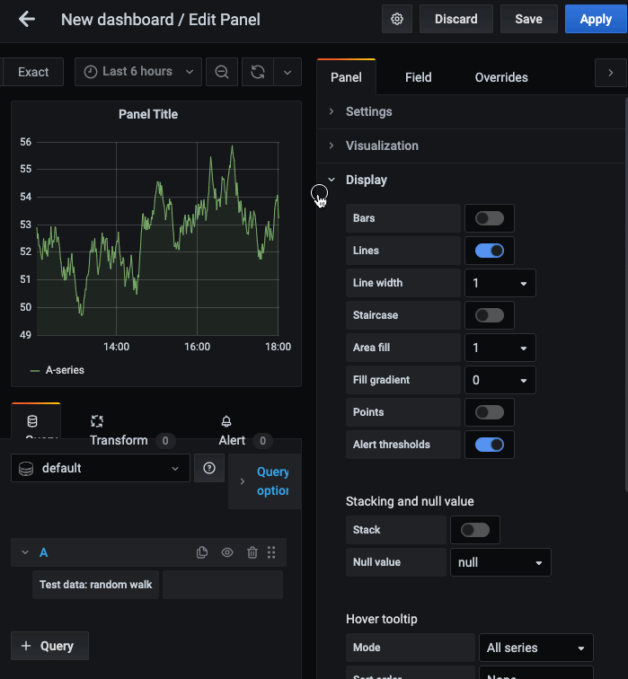

# CloudSpout Button Panel

It provides a simple Grafana panel that shows only one button - to integrate with any kind of HTTP/REST API:
* Support GET and POST HTTP verb
    * Adds no new javascript dependencies
    * Uses standard browser APIs and respects CORS
* Support API key via header `X-API-Key` or query parameter `?api-key`
* Custom label text & Grafana template design

## Configuration


## Usage



## Install

### CLI

Via the [Grafana CLI](https://grafana.com/docs/grafana/latest/administration/cli/):

```BASH
$ grafana-cli --pluginUrl https://github.com/cloudspout/cloudspout-button-panel/releases/download/7.0.1/cloudspout-button-panel.zip \
  plugins install cloudspout-button-panel
```

### Docker

Use [Grafana's environment variable](https://grafana.com/docs/grafana/latest/installation/docker/#build-and-run-a-docker-image-with-pre-installed-plugins) to add this plugin to your installation:

```BASH
$ docker run -p 3000:3000 -it \
  -e "GF_INSTALL_PLUGINS=https://github.com/cloudspout/cloudspout-button-panel/releases/download/7.0.1/cloudspout-button-panel.zip;cloudspout-button-panel" \
   grafana/grafana:7.0.3
```


## Build
First, install dependencies.
Node 12.x is required

```BASH
yarn install
```

To work with this plugin run:

```BASH
yarn watch
```

This will run linting tools and apply prettier fix.

Use an actual Docker container in parallel to test:

```BASH
docker run -d -p 3000:3000 -v "$(pwd)"/dist:/var/lib/grafana/plugins/cloudspout-button-panel --name=grafana grafana/grafana
```

To build the plugin run:

```BASH
npm run dist
```

## Deploy

```BASH
GITHUB_TOKEN=... npm run release
```

## License

GPL v3

Icons made by [Pixel perfect](https://www.flaticon.com/authors/pixel-perfect) from [www.flaticon.com](https://www.flaticon.com/)
